# HOMELAB WRITEUP

Technologies:
- Proxmox VE
- OPNsense firewall
- Active Directory (Windows Server)
- VLAN segmentation
- DHCP relay
- DMZ architecture

Features:
- network segmentation across four VLANs
- firewall rule isolation between zones
- Active Directory environment with core internal services (DNS, DHCP, domain time services)
- DHCP relay across VLANs
- DMZ-hosted public services
- VPN access for administration

## 1. Project Overview

This project implements a virtualized network with four segmented VLANs, inter-VLAN routing on OPNsense, AD-integrated DNS/DHCP, DHCP relay, WAN exposed DMZ services, and WireGuard-based remote administration.

The objective is to study fundamental principles of network architecture, segmentation, and infrastructure security through the construction of a small but realistic enterprise-style topology.

The lab focuses on:
- network segmentation
- firewall-based traffic control
- centralized identity services
- infrastructure administration networks
- service isolation through a DMZ

The infrastructure includes:
- a firewall/router
- administration hosts
- an Active Directory environment
- Windows client machines
- internal infrastructure servers
- a DMZ network hosting public services
- a VPN tunnel for remote administration

All systems are deployed inside a virtualized environment running on a single physical host.

# 2. Design Goals

The lab uses separated clients, servers, admin, and DMZ zones to enforce trust boundaries and restrict east-west traffic.

The main design goals were:

**Network segmentation**
The infrastructure is divided into multiple network zones in order to isolate services and reduce the attack surface.

**Least privilege access**
Each network is restricted to the minimum communication required for its function.

**Centralized identity and network services**
Active Directory provides authentication and core network services for domain-joined systems, including DNS, DHCP, and time synchronization.

**Realistic network topology**
The lab is structured around the following network zones :
- administrative networks
- server networks
- client networks
- DMZ service networks
- remote administrative access through a VPN tunnel

# 3. Lab Environment

The entire infrastructure runs on a single machine acting as a virtualization host.

Because of this constraint, every component of the infrastructure is virtualized:
- firewall
- servers
- client machines
- administration hosts

Virtualization makes it possible to simulate a complete multi-network infrastructure using a single physical system.

# 4. Technology Stack

The lab uses the following technologies.

**Virtualization platform**
The infrastructure is hosted on Proxmox VE, which provides virtual machines, software networking, and storage management.

**Firewall and routing**
Network routing and security policies are implemented using OPNsense.

**Operating systems**
Linux systems are used for administration and infrastructure services.

**Directory services**
A domain controller is deployed using Windows Server to provide:
- Active Directory Domain Services
- DNS
- DHCP

**WEB SERVER**
Web server is managed by nginx.

**VPN**
WireGuard is used as the VPN solution for remote administrative access and is hosted on OPNsense.

The infrastructure is divided into four isolated network zones.

Each zone represents a different trust level in the infrastructure.

**ADMIN**
The ADMIN network hosts machines are used to manage infrastructure components.
Only systems in this network are allowed to access firewall management interfaces and perform administrative tasks.

**SERVERS**
The SERVERS network hosts internal infrastructure services.
- domain controller
- DNS
- DHCP
- time synchronization
- backup services

**CLIENTS**
The CLIENTS network contains user workstations joined to the Active Directory domain.
This network has restricted access to internal services.

**DMZ**
The DMZ network hosts services intended to be reachable from outside the internal infrastructure.
Services in this zone are isolated from internal systems.

## Network topology

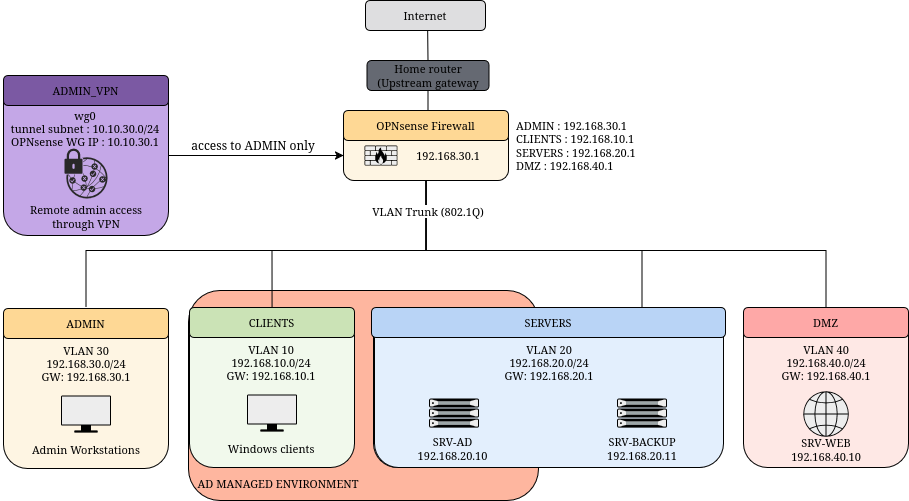

All traffic between network segments is routed through the firewall, which enforces security policies between zones.

# 6. IP Addressing and VLAN Design

Each network zone is implemented as a separate VLAN.

| Network | VLAN | Subnet          | Gateway      |
| ------- | ---- | --------------- | ------------ |
| CLIENTS | 10   | 192.168.10.0/24 | 192.168.10.1 |
| SERVERS | 20   | 192.168.20.0/24 | 192.168.20.1 |
| ADMIN   | 30   | 192.168.30.0/24 | 192.168.30.1 |
| DMZ     | 40   | 192.168.40.0/24 | 192.168.40.1 |

> *Interfaces assignment :*
>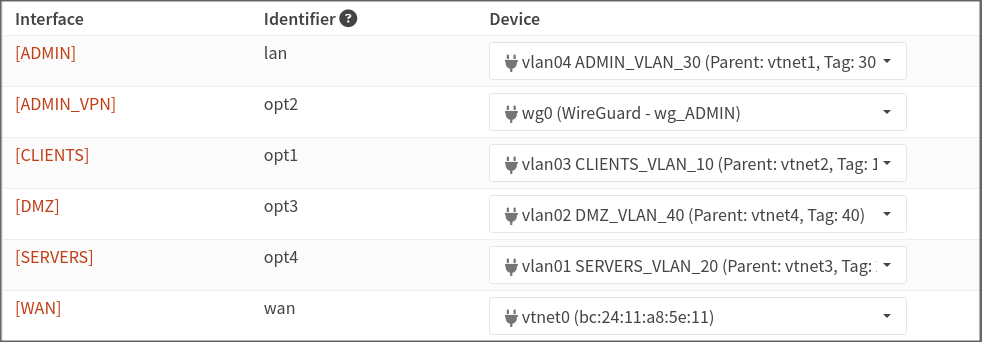

Each subnet uses the firewall as its default gateway.

The VLANs are trunked through a single bridge inside the virtualization platform, allowing the firewall to route traffic between network zones while maintaining isolation.

`ADMIN` network purpose is to isolate privileged access from user and service networks.

`CLIENTS` contains the least trusted internal managed endpoints and is restricted to only required infrastructure services.

`SERVERS` hosts core internal services and should not be broadly reachable from lower-trust zones.

`DMZ` hosts externally reachable services and is isolated to prevent compromise from pivoting inward.

# 7. Firewall and Security Model

## Policy flow diagram

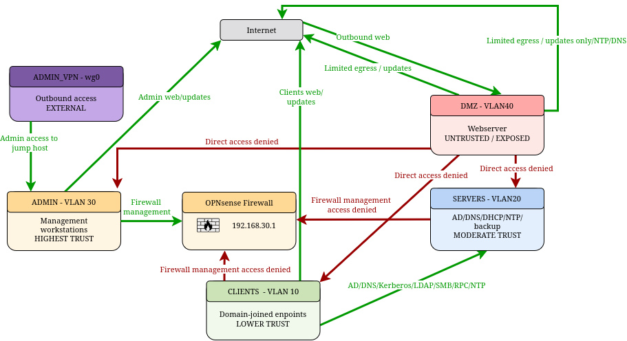

**Inter-zone access policy summary** : 
- `ADMIN` may initiate management access to all internal zones.
- `CLIENTS` may access SERVERS only for AD-related services such as DNS, Kerberos, LDAP, SMB, RPC, and NTP.
- `SERVERS` have limited outbound access for updates, DNS, and time synchronization.
- `DMZ` is isolated from internal zones and only allowed minimal supporting services.
- Internet-originated traffic is only forwarded to explicitly published `DMZ` services.
- Management access to firewall services is restricted to `ADMIN` and VPN-originated admin access.

Traffic between networks is controlled by firewall rules.

The firewall follows a **default deny model**, meaning all traffic is blocked unless explicitly allowed.

Security policies are applied between zones to restrict communication to only what is necessary.

Administrative access is allowed either from the ADMIN network or through the WireGuard VPN tunnel. The VPN is restricted to the ADMIN segment only and does not provide broad access to the rest of the internal network.

> *VPN tunnel configuration :*
> 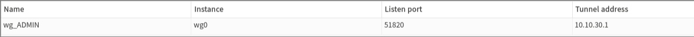

Firewall aliases are used to simplify rule management by grouping commonly used ports.

##### a. ADMIN
| Network         | Action | Rule                         | Source      | Destination     | Protocol  | Ports        |
| --------------- | ------ | ---------------------------- | ----------- | --------------- | --------- | ------------ |
| `ADMIN`         | PASS   | `ALLOW_ADMIN_WEB_OUT`        | `ADMIN net` | `*`             | TCP       | `WEB_PORTS`  |
| `ADMIN`         | PASS   | `ALLOW_ADMIN_DNS_TO_FORWARD` | `ADMIN net` | `This Firewall` | TCP / UDP | `DNS_PORT`   |
| `ADMIN`   | PASS   | `ALLOW_MGMT_FROM_ADMIN`   | `ADMIN net` | `This Firewall` | TCP       | `MGMT_PORTS` |
| `ADMIN`         | PASS   | `ALLOW_NTP_TO_FIREWALL`      | `ADMIN net` | `This Firewall` | UDP       | `NTP_PORT`   |

##### b. CLIENTS

| Network       | Action    | Rule                               | Source        | Destination     | Protocol  | Ports             |
| ------------- | --------- | ---------------------------------- | ------------- | --------------- | --------- | ----------------- |
| `CLIENTS`     | BLOCK  | `BLOCK_MANAGEMENT_FROM_CLIENTS`    | `CLIENTS net` | `This Firewall` | TCP       | `MGMT_PORTS`      |
| `CLIENTS`  | PASS      | `ALLOW_DNS_TO_DC`               | `CLIENTS net` | `DC_IP`         | TCP / UDP | `DNS_PORT`        |
| `CLIENTS`     | PASS   | `ALLOW_CLIENTS_BROADCAST_FOR_DHCP` | `CLIENTS net` | `BROADCAST`     | UDP       | `DHCP_PORTS`      |
| `CLIENTS`     | PASS      | `ALLOW_CLIENTS_WEB_OUT`            | `CLIENTS net` | `*`             | TCP       | `WEB_PORTS`       |
| `CLIENTS`     | PASS      | `ALLOW_CLIENTS_RPC_RANGE_TO_DC`    | `CLIENTS net` | `DC_IP`         | TCP       | `RPC_PORTS_RANGE` |
| `CLIENTS`     | PASS      | `ALLOW_RPC_TO_DC`                  | `CLIENTS net` | `DC_IP`         | TCP       | `RPC_PORT`        |
| `CLIENTS`  | PASS      | `ALLOW_KERBEROS_TO_DC`             | `CLIENTS net` | `DC_IP`         | TCP       | `KERBEROS_PORTS`  |
| `CLIENTS`     | PASS      | `ALLOW_NETBIOS_TO_DC`           | `CLIENTS net` | `DC_IP`         | TCP / UDP | `NETBIOS_PORTS`   |
| `CLIENTS`  | PASS      | `ALLOW_LDAP_TO_DC`              | `CLIENTS net` | `DC_IP`         | TCP       | `LDAP_PORT`       |
| `CLIENTS`     | PASS      | `ALLOW_SMB_TO_DC`                  | `CLIENTS net` | `DC_IP`         | TCP       | `SMB_PORT`        |
| `CLIENTS`     | PASS      | `ALLOW_NTP_TO_DC`                  | `CLIENTS net` | `DC_IP`         | UDP       | `NTP_PORT`        |
##### c. SERVERS
| Network   | Action | Rule                           | Source        | Destination     | Protocol | Ports            |
| --------- | ------ | ------------------------------ | ------------- | --------------- | -------- | ---------------- |
| `SERVERS` | BLOCK  | `BLOCK_MGMT_FROM_SERVERS`      | `SERVERS net` | `This Firewall` | TCP      | `MGMT_PORTS`  |
| `SERVERS` | PASS   | `ALLOW_SERVERS_WEB_OUT`        | `SERVERS net` | `*`             | TCP      | `WEB_PORTS`      |
| `SERVERS` | PASS   | `ALLOW_SERVERS_DNS_TO_FORWARD` | `SERVERS net` | `This Firewall` | UDP      | `DNS_PORT`       |
| `SERVERS` | PASS   | `ALLOW_NTP_TO_FIREWALL`        | `SERVERS net` | `This Firewall` | UDP      | `NTP_PORT`       |

##### d. DMZ
| Network | Action | Rule                           | Source    | Destination                               | Protocol | Ports            |
| ------- | ------ | ------------------------------ | --------- | ----------------------------------------- | -------- | ---------------- |
| `DMZ`   | BLOCK  | `BLOCK_MGMT_FROM_DMZ`          | `DMZ net` | `This Firewall`                           | TCP      | `MGMT_PORTS`  |
| `DMZ`   | BLOCK  | `BLOCK_ACCESS_TO_ALL NETWORKS` | `DMZ net` | `ADMIN net`, `CLIENTS net`, `SERVERS net` | `*`      | `*`              |
| `DMZ`   | PASS   | `ALLOW_DMZ_DNS_TO_FW`          | `DMZ net` | `This Firewall`                           | UDP      | `DNS_PORT`       |
| `DMZ`   | PASS   | `ALLOW_NTP_TO_FIREWALL`        | `DMZ net` | `This Firewall`                           | UDP      | `NTP_PORT`       |

> *Clients firewall rules :*
> 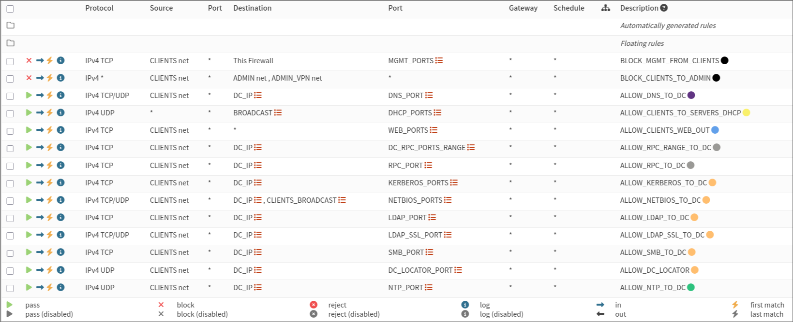
> *DMZ firewall rules :*
> 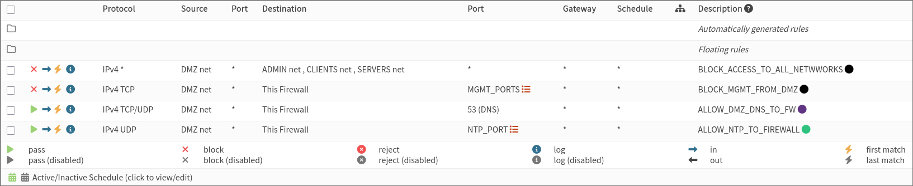

# 8. Infrastructure Services

Several infrastructure services are deployed inside the SERVERS network.

### Active Directory

The domain controller provides:
- authentication
- DNS services
- DHCP services
- time services for domain-joined systems

Server configuration:
- Hostname: **SRV-AD**  
- IP address: **192.168.20.10**
- Domain name: home.arpa

Windows client machines located in the CLIENTS network are joined to this domain.

### DHCP and DNS

DNS and DHCP are managed by the domain controller.

Because DHCP requests do not cross network boundaries by default, the firewall is configured as a **DHCP relay agent**.

DHCP requests originating from the CLIENTS network are forwarded to the domain controller located in the SERVERS network.

>*OPNsense DHCRelay configuration :*
> 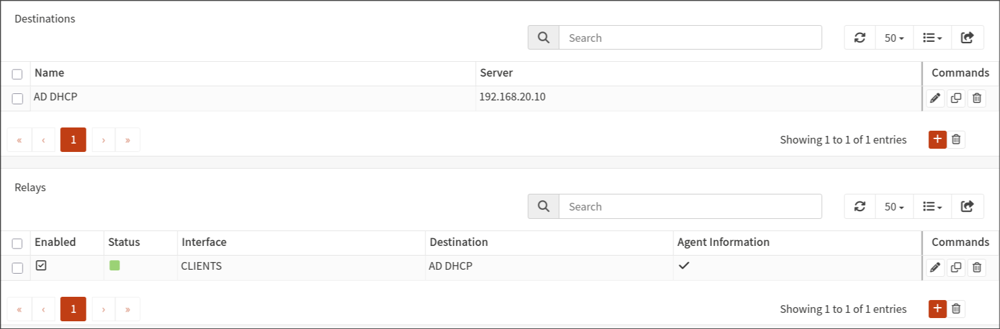
>*DHCP IP range :*
> 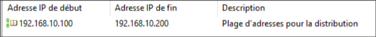

### NTP services

Time synchronization was split according to system role. Domain-joined Windows clients obtain time from the Active Directory hierarchy through the domain controller, while non-domain or infrastructure systems use the firewall as an NTP source.

### DMZ services

The DMZ network is used to host services intended to be reachable from outside the internal infrastructure.

These services are isolated from internal networks through firewall policies.

Because these services use private internal addresses, port forwarding is required on OPNsense to make selected DMZ hosts reachable from the internet.
Inbound WAN traffic is translated and forwarded only to explicitly published services, such as HTTP and HTTPS, while all other unsolicited access remains blocked by default.

> *OPNsense port forwarding configuration :*
> 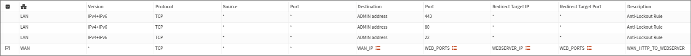
### Backup server

A dedicated Linux system is deployed in the SERVERS network to host backup services.

This server is intended to store backups of critical infrastructure machines.

# 9. Virtualization Networking

Networking inside the virtualization platform is implemented using a VLAN-aware bridge.

This bridge carries VLAN-tagged traffic between virtual machines and the firewall.

Each virtual machine is connected to the appropriate VLAN corresponding to its network zone.

The firewall has one interface per VLAN and performs routing between network segments.

> *Client Proxmox NIC config :*
> 
>
> *OPNsense VLAN configuration :* 
>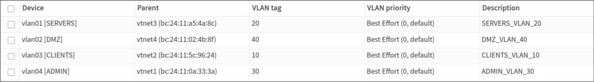
# 10. Architecture Evolution

The first version of the lab used separate virtual bridges to isolate each network. While this provided basic separation, it did not model segmentation over a shared 802.1Q trunk.  The design was therefore migrated to VLANs. 

A VLAN-aware bridge was introduced in Proxmox, allowing OPNsense to route between tagged networks over a single trunk while preserving isolation at Layer 2 through VLAN tagging.  

This change aligned the lab more closely with how segmented networks are commonly deployed on managed switching infrastructure.

A later evolution of the lab introduced a WireGuard VPN service hosted on OPNsense. This addition provided a controlled remote administration path without exposing management interfaces directly to less trusted networks.

VPN clients are restricted to the ADMIN network, which preserves the separation between administrative access and the rest of the infrastructure while more closely reflecting real-world remote management practices.

# 11. Deployment and Validation

Several virtual machines were deployed to validate the network configuration.

Test machines were placed in each subnet to verify:
- IP address assignment
- DNS resolution
- connectivity between network zones
- domain join functionality

A temporary ICMP firewall rule was enabled during testing to validate connectivity and isolate routing versus policy issues. It was removed after verification so that the final ruleset remained consistent with the intended security model.

A Windows client machine was successfully joined to the Active Directory domain and received network configuration through DHCP.

> *Client ip config :*
> 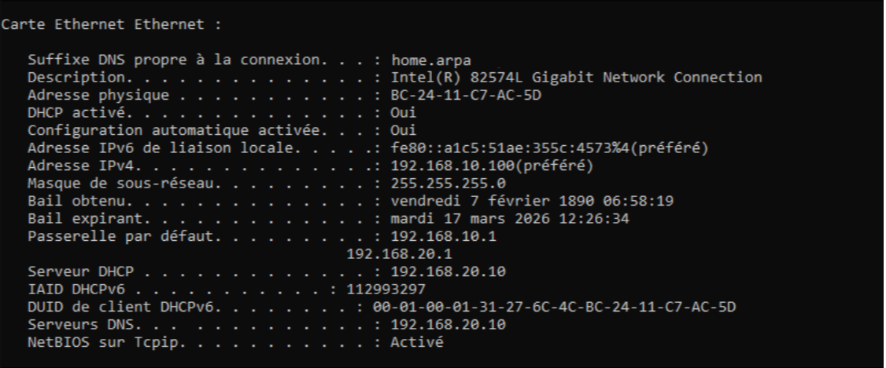

>*DNS resolution from client :*
>
> 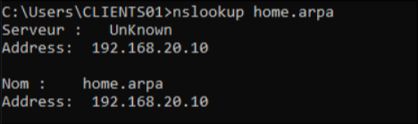

>*Client network identity :*
>
> 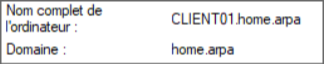

>*DHCP lease for client :* 
> 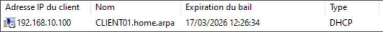

>*IP route for VPN client :*
> 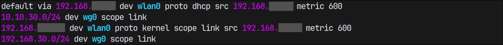

>*VPN client access to admin subnet :*
>![[images/vpn_client_access_to_admin_subnet.png]]

# 12. Troubleshooting and Lessons Learned

Several technical issues were encountered during the deployment process.

During Windows installation, the virtual disk was not detected.  
The VirtIO storage drivers had to be manually loaded in the installer.

The Windows installer initially failed to detect the network interface.  
Changing the adapter model to **e1000e** resolved the issue.

Accessing the firewall web interface over HTTPS initially failed in Microsoft Edge.  
Switching to Firefox resolved the problem.

After migrating the ADMIN network to VLAN segmentation, DHCP requests stopped reaching the domain controller.  
Restarting the DHCP relay service restored normal operation.

Multicast discovery traffic such as SSDP and mDNS was explicitly blocked at the firewall boundary. These protocols are useful on flat local networks for device discovery, but they were not required in this lab and would undermine segmentation by allowing unnecessary cross-zone service discovery.

# 13. Future Improvements

Several improvements are planned for future iterations of the lab.

Possible extensions include:
- centralized logging infrastructure
- monitoring and alerting systems
- additional services hosted in the DMZ
- automated backup workflows

These additions will allow the lab to more closely resemble a complete enterprise infrastructure.
